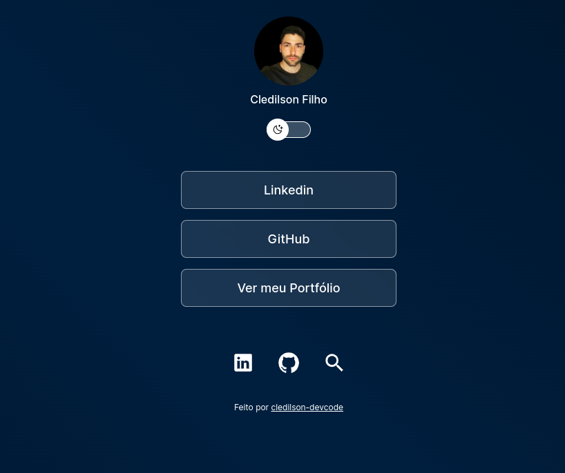

<h1 align="center"> Links - Portfólio </h1>

Projeto desenvolvido para demonstrar o acesso as informações como cartão de visitas online.

  <a href="#-tecnologias">Tecnologias</a>&nbsp;&nbsp;&nbsp;|&nbsp;&nbsp;&nbsp;
  <a href="https://cledilson-devcode.github.io/cledevcodelinks/" target="_blank">Projeto</a>

  

 

  

## 🚀 Tecnologias

Esse projeto foi desenvolvido com as seguintes tecnologias:

- HTML e CSS
- JavaScript

## 💻 Projeto

Este um agregador de links para usar como cartão de visitas online.

## :memo: Licença

Esse projeto está sob a licença MIT.
